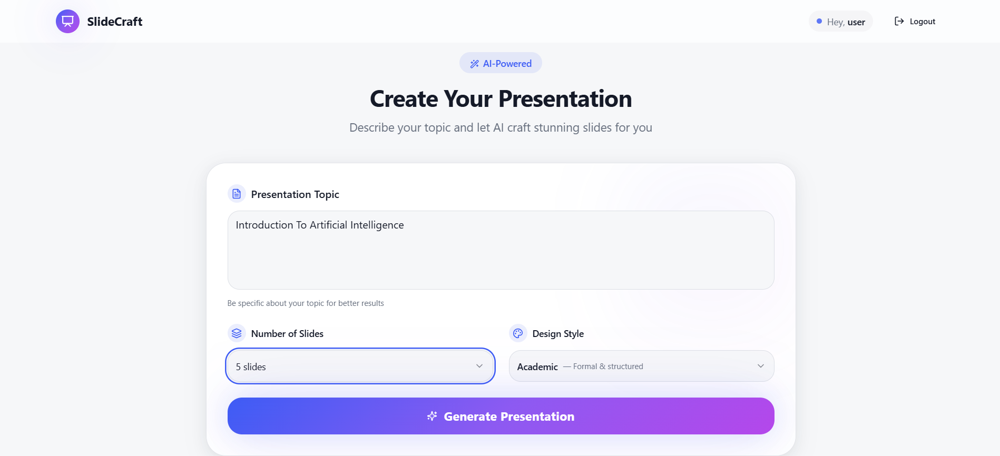
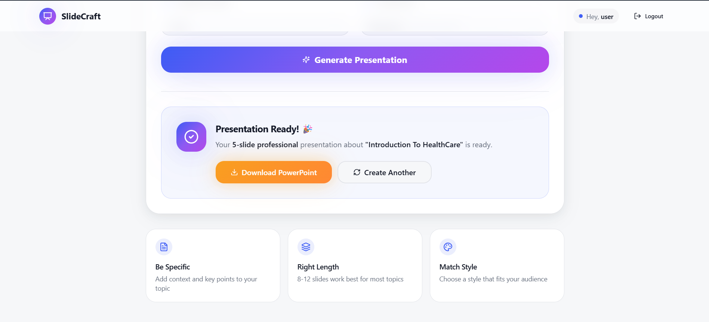

# Autonomous Generative AI Agent for Presentation Creation

## 📌 Project Overview

This project is an **Autonomous Generative AI Agent** designed to automatically create professional presentations from minimal user input. The system leverages **Generative AI**, **FastAPI**, and **Google Authentication** to provide a secure, scalable, and intelligent solution for presentation creation.

Users can sign up, log in (including via **Google OAuth**), submit a topic or prompt, and receive a structured, AI-generated presentation outline or content.

---

## 🚀 Key Features

* 🔐 **Authentication System**

  * Email & Password Signup/Login
  * Google OAuth 2.0 Login (ID Token based)
* 🤖 **Generative AI Agent**

  * Converts prompts into structured presentation content
  * Slide-wise logical flow
* ⚡ **FastAPI Backend**

  * High performance REST APIs
  * Automatic API documentation with Swagger
* 🗄️ **Database Integration**

  * User management
  * Secure token handling
* 🧪 **Token Validation Utilities**

  * Google ID token verification

---

## 🏗️ Tech Stack

### Backend

* **Python 3.10+**
* **FastAPI**
* **SQLAlchemy**
* **OAuth 2.0 (Google Authentication)**
* **JWT**
# Autonomous Generative AI Agent for Presentation Creation

This repository contains a full-stack prototype that generates presentation slides (PowerPoint) from a user prompt using AI agents. The project is split into two main parts:

- `backend/` — FastAPI service that runs agents, handles authentication, generates slides and builds PPTX files.
- `frontend/` — Vite + React TypeScript app that provides a UI for signup/login and generating/downloading presentations.

This README documents how to run each part, environment variables, key files, and debugging notes.

## Quick start (recommended)

1. Start backend:

```bash
cd backend
python -m venv ../genAI_env    # optional: create venv at repo root
# activate venv (Windows)
genAI_env\Scripts\activate
pip install -r requirements.txt
uvicorn main:app --reload --port 8000
```

2. Start frontend:

```bash
cd frontend
npm install
npm run dev
# open http://localhost:8081
```

## Backend

- Location: `backend/`
- Entry: `backend/main.py` (FastAPI app)
- Important packages: `fastapi`, `uvicorn`, `sqlalchemy`, `python-jose`, `passlib`, `httpx`, `python-dotenv`, `python-pptx`, `Pillow`.
- Requirements: see `backend/requirements.txt`.

Key endpoints
- `POST /auth/signup` — create user (returns `access_token`)
- `POST /auth/login` — login (returns `access_token`)
- `POST /auth/google-login` — accept Google ID token and return app token
- `POST /generate_ppt` — protected endpoint (requires Bearer JWT) that runs the planning/execution agents and returns a PPTX file.

Authentication
- JWT tokens are issued by the backend (`auth.utils.create_access_token`) and validated via `auth.dependencies.get_current_user`.
- During development the backend accepts tokens via `Authorization: Bearer <token>`, and (fallback) via `access_token` query param or `x-access-token` header to support browser form downloads.

Important backend files
- `backend/auth/` — authentication routes, models, Google token verification.
- `backend/agents/` — planner & executor agents. Images are produced by `backend/agents/executor/image_agent.py` (uses OpenAI to craft Unsplash queries and fetches images via Unsplash API).
- `backend/ppt/ppt_builder.py` — builds the final PPTX and embeds images (downloads via `httpx`).

Environment variables (backend)
- `GOOGLE_CLIENT_ID` — Google OAuth client id (for Google Login flow).
- `OPENAI_API_KEY` — OpenAI API key (used by image_agent and LLMs).
- `UNSPLASH_ACCESS_KEY` — Unsplash API key for fetching images.
- `JWT_SECRET_KEY`, `JWT_ALGORITHM`, `JWT_EXPIRE_MINUTES` — JWT config (in `backend/core/config.py` or `.env`).

Notes on images
- The backend downloads images (Unsplash) during execution and embeds them into the PPTX. If PPTX generated via a fetch/XHR appears to lack images but running the backend independently produces images, try the browser-form fallback (frontend has a small retry) or run the backend locally and invoke `POST /generate_ppt` directly (server-side generation works).

## Frontend

- Location: `frontend/`
- Framework: Vite + React + TypeScript
- Entry: `frontend/src/main.tsx` and pages under `frontend/src/pages/` (notably `Login.tsx`, `Register.tsx`, `Dashboard.tsx`).
- Env: `frontend/.env` contains `VITE_API_BASE_URL` (defaults to `http://localhost:8000`).

Auth & API
- Auth context: `frontend/src/contexts/AuthContext.tsx` — manages token + `getAuthHeader()` helper that returns `Authorization: Bearer <token>` for API calls.
- The Dashboard `Generate` button POSTs to `${VITE_API_BASE_URL}/generate_ppt` with the `Authorization` header and downloads the returned PPTX blob. If the blob is unexpectedly small (images missing), frontend triggers a fallback hidden form POST with the token in `access_token` query param to force a normal browser download that matches backend behavior.

Key frontend files
- `frontend/src/pages/Dashboard.tsx` — generation UI and download logic.
- `frontend/src/contexts/AuthContext.tsx` — login/register wrappers that call backend `/auth/*` endpoints and store `access_token` in `localStorage`.

Dev scripts
- `npm run dev` — start Vite dev server (default port in this workspace is `8081`).

## How to generate a presentation (end-to-end)

1. Start backend on port `8000` (see above).
2. Start frontend on port `8081` (see above).
3. In the app: sign up or sign in (or use Google login flow).
4. Open `Dashboard`, enter a topic, choose slide count and style, and click **Generate Presentation**.
5. The browser will download the generated `.pptx`. If images are missing, the frontend will attempt a form-based retry that includes the token in the query string to force a full server-side download.

## Troubleshooting

- If images are missing in the downloaded PPTX but backend generates images when run standalone:
  - Confirm `OPENAI_API_KEY` and `UNSPLASH_ACCESS_KEY` are set and valid in the backend environment.
  - Start backend locally and call `/generate_ppt` using `curl` or via browser form to confirm server-produced PPTX contains images.
  - The frontend includes a fallback (hidden form POST) to handle differences between XHR downloads and full browser downloads.

- CORS: backend allows CORS from the frontend dev origin (`http://localhost:8081`) in `backend/main.py` — update if you run the frontend on a different origin.

## Tests & scripts

- `backend/test_ppt_builder_script.py` — quick script to exercise the `ppt_builder` locally.
- `backend/test_image.py` — utilities for testing image fetch logic.

## Notes for contributors

- Keep authentication logic in `frontend/src/contexts/AuthContext.tsx` synced with backend `/auth` routes.
- If you improve image generation reliability, prefer fixing server-side behavior in `backend/agents/executor/image_agent.py` or `backend/ppt/ppt_builder.py` rather than relying on frontend fallbacks.

## License

MIT

---
_If you want this README expanded with examples, OpenAPI summary snippets, or a CONTRIBUTING guide, tell me which sections to expand._

## Examples & Results

Below are example outputs produced by this project. The images and sample presentation are included in the repository under the `Results/` folder so you can preview or download them directly.

### Example reference images

These images are representative samples generated and embedded into slides during PPT creation.





You can find additional generated images in the `Results/images/` folder.

### Sample generated PPTs

Download a sample generated presentation to inspect slide layout, embedded images, and notes:

- [Download sample PPTX](Results/ppt/sampleppt.pptx)

### How to reproduce these results locally

1. Start the backend (recommended port `8000`):

```bash
cd backend
genAI_env\Scripts\activate   # or activate your Python venv
pip install -r requirements.txt
uvicorn main:app --reload --port 8000
```

2. Start the frontend (recommended port `8081`):

```bash
cd frontend
npm install
npm run dev
# open http://localhost:8081 in your browser
```

3. Generate a presentation via the app UI or call the backend `POST /generate_ppt` endpoint. Generated slides, embedded images, and output PPTX files are saved under the `Results/` folder by the test scripts and some local runs.

Notes:
- If images do not appear in a downloaded `.pptx`, try generating from the backend directly (server-side generation) or inspect `backend/output/` and `Results/` for logs and saved assets.
